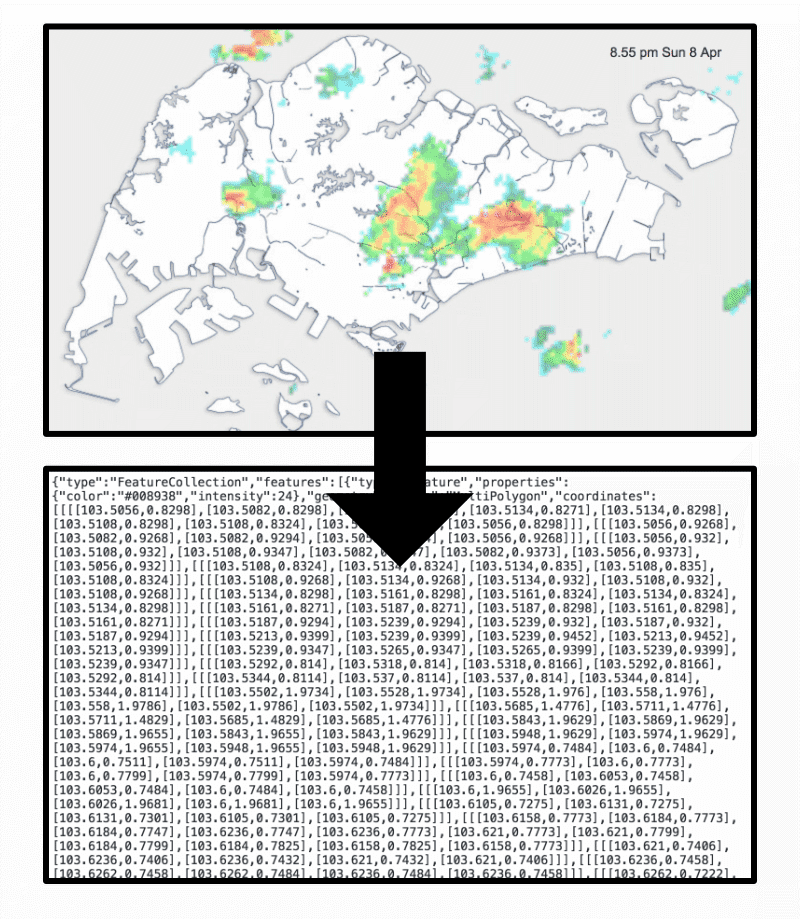

Rain GeoJSON SG
===

> Straight-forward API server to convert rain area radar images (Singapore) to GeoJSON.

- 50-km radar images: [Weather.gov.sg](http://www.weather.gov.sg/weather-rain-area-50km/)
- 70-km radar images: [MyENV apps](http://www.nea.gov.sg/)
- Radar images are generated every 5 minutes.
- Raster image is converted to GeoJSON, pixel by pixel. From pixels to polygons.
- Polygons in GeoJSON are grouped by color/intensity into `MultiPolygon`s. Adjacent polygons are unioned/combined.
- Intensity values are improvised to be 0-100. These may not be standard/scientific values. They are reverse-engineered from the rain intensity color scheme (Light → Moderate → Heavy).
- Only the latest GeoJSON data is cached and will updated every few minutes.

Technicalities
---

[Node.js](https://nodejs.org/) is required to run this server. These are the commands:

- `npm i` - install all dependencies
- `npm run dev` - run a development server
- `npm start` - run a production server

The URLs:

- `/` - return this README file
- `/now` - return the GeoJSON result of latest radar image

Copyright/License
---

- Rain area radar images © [Meteorological Service Singapore](http://www.weather.gov.sg/) © [National Environment Agency](http://www.nea.gov.sg/)
- Code under [MIT](https://cheeaun.mit-license.org/).